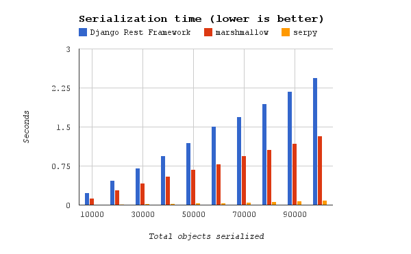
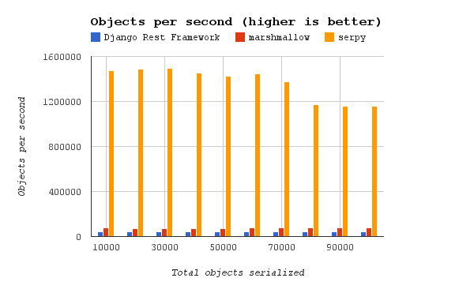
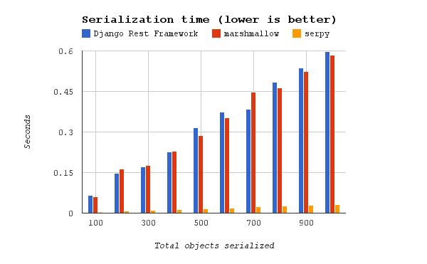

**********************
Performance Benchmarks
**********************

**serpy** was compared against two other popular serializer frameworks:

  - `marshmallow <http://marshmallow.readthedocs.org>`_
  - `Django Rest Framework Serializers
    <http://www.django-rest-framework.org/api-guide/serializers/>`_

These graphs show the results. The benchmark scripts are found in the
`benchmarks <https://github.com/clarkduvall/serpy/tree/master/benchmarks>`_
directory in the **serpy** `GitHub repository
<https://github.com/clarkduvall/serpy>`_. Run these benchmarks yourself with:

.. code-block:: bash

   $ git clone https://github.com/clarkduvall/serpy.git && cd serpy
   $ tox -e benchmarks

Results
=======

These benchmarks were run on a Lenovo T530 with a 2-core 2.5 GHz i5 processor
and 8G of memory.

Simple Benchmark
----------------

This benchmark serializes simple objects that have a single field.

Complex Benchmark
-----------------

This benchmark serializes nested objects with multiple fields of different
types.

.. image:: _static/bm_complex_objects.png

Data
----

.. csv-table:: bm_simple.py time taken (in seconds)
   :header: "# objects","Django Rest Framework","marshmallow","serpy"

   10000,0.2414798737,0.1281440258,0.006773948669
   20000,0.4704430103,0.2609949112,0.01343297958
   30000,0.7049410343,0.3850591183,0.02005600929
   40000,0.9448800087,0.5248949528,0.02748799324
   50000,1.196242809,0.6589410305,0.03510689735
   60000,1.513856888,0.8019201756,0.04155898094
   70000,1.695443153,0.9703800678,0.05080986023
   80000,1.943806887,1.04428792,0.06843280792
   90000,2.189687967,1.16334486,0.07787084579
   100000,2.445794821,1.302541018,0.0864470005

.. csv-table:: bm_simple.py objects per second
   :header: "# objects","Django Rest Framework","marshmallow","serpy"

   10000,41411.31867,78037.19243,1476243.841
   20000,42513.11968,76629.84657,1488872.954
   30000,42556.7509,77910.11452,1495811.034
   40000,42333.41761,76205.72419,1455180.8
   50000,41797.53442,75879.32408,1424221.557
   60000,39633.86532,74820.41459,1443731.262
   70000,41287.14069,72136.68368,1377685.349
   80000,41156.35177,76607.22533,1169029.92
   90000,41101.74662,77363.1303,1155759.888
   100000,40886.50411,76773.01417,1156778.135

.. csv-table:: bm_complex.py time taken (in seconds)
   :header: "# objects","Django Rest Framework","marshmallow","serpy"

   100,0.06559991837,0.07014703751,0.003219127655
   200,0.1476380825,0.1144611835,0.006608009338
   300,0.171423912,0.169506073,0.009553909302
   400,0.2272388935,0.2767920494,0.01268196106
   500,0.3147311211,0.2825651169,0.0157828331
   600,0.3746049404,0.3694860935,0.01907610893
   700,0.3846490383,0.3978009224,0.02250695229
   800,0.4846799374,0.4635269642,0.02613210678
   900,0.5376219749,0.5094399452,0.02945303917
   1000,0.5961399078,0.5659701824,0.03282499313

.. csv-table:: bm_complex.py objects per second
   :header: "# objects","Django Rest Framework","marshmallow","serpy"

   100,1524.392141,1425.576953,31064.3164
   200,1354.664031,1747.317246,30266.30105
   300,1750.047566,1769.848093,31400.75863
   400,1760.262048,1445.128214,31540.86329
   500,1588.65764,1769.50363,31679.99033
   600,1601.687365,1623.877084,31452.95522
   700,1819.840765,1759.67415,31101.50104
   800,1650.573788,1725.897438,30613.68173
   900,1674.038715,1766.645919,30557.11823
   1000,1677.458574,1766.877534,30464.59129
